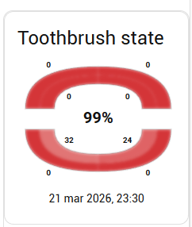
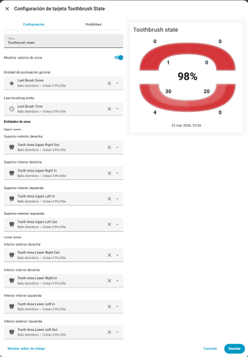

# Toothbrush State Card

[](https://github.com/McGiverGim/toothbrush-state-card/releases)
[](https://github.com/McGiverGim/toothbrush-state-card/blob/master/LICENSE)

> **Background:** This card was originally built to work alongside the [Oclean Home Assistant integration](https://github.com/deniskie/ha-oclean-integration/), which exposes per-zone brushing scores as numeric sensors. However, it is fully integration-agnostic — any integration (or manual helper) that publishes zone data as `sensor`, `number`, or `input_number` entities with values in the `0..100` range will work just as well.

A custom Home Assistant (Lovelace) card displaying an SVG dental map divided into 8 zones.



The zones are:
- Upper outer right
- Upper inner right
- Lower outer right
- Lower inner right
- Upper outer left
- Upper inner left
- Lower outer left
- Lower inner left

Each zone is linked to a numeric entity (`sensor`) in the `0..100` range:

- `0` = deep red
- `100` = white
- Values in between = red → white gradient

If the entity does not exist or is not numeric, the zone is shown in grey.

## Installation (HACS)

1. Push this repository to GitHub.
2. In Home Assistant, open HACS → Frontend → 3-dot menu → Custom repositories.
3. Add the repo URL and select category **Dashboard**.
4. Install **Toothbrush State Card**.
5. Restart Home Assistant (or reload frontend resources).

## Lovelace Resource

If it does not appear automatically, add the resource manually:

- URL: `/hacsfiles/toothbrush-state-card/dist/toothbrush-state-card.js`
- Type: `module`

## Example Configuration

It has a card's editor, that can be used in the Lovelace UI editor to visually link each zone to an entity:



But if you prefer YAML, here is an example configuration:

```yaml
type: custom:toothbrush-state-card
title: Brushing state
show_values: true
score: sensor.last_brush_score
last_brush_time: sensor.last_brush_time
upper_right_out: sensor.upper_right_out
upper_right_in: sensor.upper_right_in
lower_right_out: sensor.lower_right_out
lower_right_in: sensor.lower_right_in
upper_left_out: sensor.upper_left_out
upper_left_in: sensor.upper_left_in
lower_left_out: sensor.lower_left_out
lower_left_in: sensor.lower_left_in
```

## Options

| Option | Type | Default | Description |
|---|---|---|---|
| `title` | string | _(none)_ | Card title. If omitted, no title is shown. |
| `show_values` | boolean | `true` | Show numeric value in each zone. |
| `score` | entity\_id | _(none)_ | Overall score (0..100) displayed in the centre. |
| `last_brush_time` | entity\_id | _(none)_ | Last brushing date/time entity, shown below the diagram. |
| `upper_right_out` | entity\_id | _(none)_ | Upper outer right zone. |
| `upper_right_in` | entity\_id | _(none)_ | Upper inner right zone. |
| `lower_right_out` | entity\_id | _(none)_ | Lower outer right zone. |
| `lower_right_in` | entity\_id | _(none)_ | Lower inner right zone. |
| `upper_left_out` | entity\_id | _(none)_ | Upper outer left zone. |
| `upper_left_in` | entity\_id | _(none)_ | Upper inner left zone. |
| `lower_left_out` | entity\_id | _(none)_ | Lower outer left zone. |
| `lower_left_in` | entity\_id | _(none)_ | Lower inner left zone. |

## Notes

- Zone orientation follows the viewer's perspective (visual right = right in configuration).
- Values are automatically clamped to the `0..100` range.
- Date/time values are formatted using the locale configured in Home Assistant.

## Development

The repository includes a `preview.html` file for local development — no build step required.

Because the card uses ES modules (`import.meta.url`, `fetch` for translation files), it must be served over HTTP rather than opened as a `file://` URL.

**Using Node.js (recommended):**

```bash
npx serve .
# or
npx http-server . -p 8080
```

Then open the URL shown in the terminal (usually `http://localhost:3000` or `http://localhost:8080`).

**Using Python:**

```bash
python -m http.server 8080
```

Then open `http://localhost:8080/preview.html`.

The preview offers:
- **Card tab** — three size previews (100%, 50%, 25%) with a "Randomize values" button.
- **Editor tab** — visual mock of the configuration editor UI.
- **Language selector** — switch between `EN` and `ES` to verify translations.
